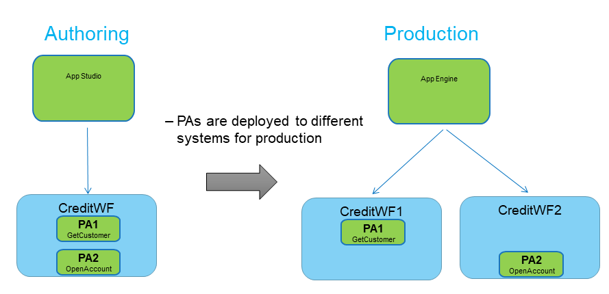
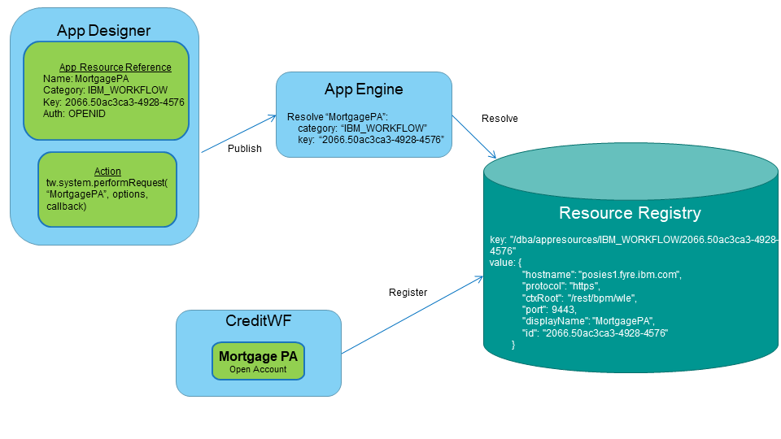
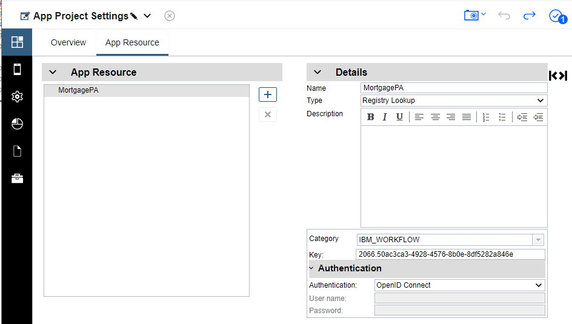

# Application Resources
The motivation for Application Resources is to enable the dynamic resolution of resources during the lifecycle of an application. Take for example, calling a Business Automation Workflow (BAW) process from an application. The process is contained in a Process Application, which is the deployment unit for that pillar. The Process Application may be on a given server during the development of the application. When the application is published to a production server, the Process Application is on a different server. In the diagram below, we see that there are two Process Applications running in the CreditWF Workflow Center at development time. When the application is published to production, the Process Applications are deployed to different, separate Process Servers.



How do we author applications to call resources so that they are independent of the ever-changing endpoint? How do we resolve such resources at runtime in a dynamic and automatic way? The answer is Application Resources.

### Overview
The main idea behind Application Resources is that there is a central repository, the Resource Registry. Runtime environments write information about their deployed artifacts to this registry. Runtimes must keep the registry up to date as resources are deployed and undeployed. The information for each Application Resource is registered by using a unique, predictable key, which usually would include some sort of ID associated with the resource and a segment unique to the pillar/system type. At authoring time, an Application Resource reference is modeled, which also contains the key, plus an alias/name, credentials, etc. The alias is used in a runtime API which automatically resolves the endpoint by looking up the key in the registry.



### Resource Registry
For details about connecting your pillar or server to the resource registry, and how to write to the registry, refer to the topic [Resource Registry](../../Resource%20Registry)

### Application Resource Registration
The key structure for Application Resource follows a specific pattern. The key is structured as:  
<pre>
/dba/appresources/&lt;category&gt;/&lt;app resource ID&gt;  
</pre>
* The &lt;category&gt; segment is unique to the pillar or system type to avoid collisions with Application Resource IDs.  
* The &lt;app resource ID&gt; segment is unique to the resource. It needs to be a predicable, known ID, as determined by the system. An ID for the resource is a common piece of information to use. Also, version information could be incorporated into this segment if desired. Note that there could actually be many segments.  

The value structure for an Application Resource must follow a prescribed structure in order for consumers to make use of the information. The value is a stringified JSON object following this sample structure:
```json
"value": {
            "hostname": "posies1.fyre.ibm.com",
            "protocol": "https",
            "ctxRoot": "/rest/bpm/wle",
            "port": 9443,
            "displayName": "MortgagePA",
            "id": "2066.50ac3ca3-4928-4576-8b0e-8df5282a846e"
        }
``` 
The above attributes are self-explanatory. The properties are used to create a complete, callable endpoint. The ID does not need to be the same as the application resource ID segment in the key. Additional properties above and beyond the base set may be written to the value.

Servers on which resources are deployed must register them to the Resource Registry and keep them up to date. This may be done in the server itself by listening to internal, system-specific events. For example, BAW listens to the repository for Process Applications that are created/delete/restores/archived and updates the registry accordingly with *zero* delay.

In BAW, the Java code for writing application resource keys using a lease is similar to the code below.
Using leases requires a periodically scheduled task, or a thread that wakes up before the lease expires and rewrites the data. 
```java
ScheduledExecutorService ses = Executors.newScheduledThreadPool(1);
ScheduledFuture<?> scheduledFuture = ses.schedule(registerEntriesTask(), 30, TimeUnit.SECONDS);
    
private Callable<Object> registerEntriesTask() {
  final Callable<Object> renewWrite = new Callable<Object>() {
    public Object call() {
      final int retryTime = 5 * 60; // 5 minutes
      final int leaseTTL = 60 * 60; // 60 minutes
      long rescheduleDelay = leaseTTL - retryTime;
      IEtcdLib etcdLib = EtcdLibFactory.getInstance(EtcdProtocolType.RestGateway);
      try {
        String token = etcdLib.authenticate();
        String leaseID = etcdLib.createLease(token, leaseTTL);
         //next lines assume there is a value defined for projectID and a function called constructJSONfromProject
        JSONObject value = constructJSONfromProject(projectID);
        String key = REGISTRY_
        S_KEY + "/" + projectID;
        etcdLib.writeKey(token, key, value, leaseID);
      } catch(Exception e) {
        rescheduleDelay = retryTime;
      }
      ses.schedule(this, rescheduleDelay, TimeUnit.SECONDS);
      return null;
    }
  };
  return renewWrite;
}

```

### Application Resource References
At authoring time, there is a modeled artifact for capturing the information needed to lookup an Application Resource. These references are found in the settings editor of the Application or Toolkit project.  


There are two types of Application Resource references in Application Designer, with fields specific to each type. The "name" property is common to both. The name uniquely defines the Application Resource reference within the scope of the project. It is used to resolve the reference via the runtime API which is leveraged by the scripts within your action. The `tw.system.performRequest(name, options, callback, errorcallback)` API is called to make a REST call with an automatically resolved Application Resource endpoint. The runtime will take the alias name of the Application Resource reference and dynamically resolve it to an endpoint then make the REST call. For more information on these APIs, see:  
[Knowledge Center - JavaScript APIs for actions](https://www.ibm.com/support/knowledgecenter/SSYHZ8_19.0.x/com.ibm.dba.appdesign/topics/ref_appdesign_action_api.html)

Application Resource references may be defined in both Application and Toolkit projects. An Application project has visibility to all Application Resource references defined in referenced toolkits. If a Toolkit or Application project defines an Application Resource reference with the same name as a referenced toolkit, this is considered an override. For example, an Application might want to change the credentials for an Application Resource reference defined and used in a referenced toolkit.

#### Type: Registry Lookup
Registry lookup is the mechanism allowing Application Resources to be automatically resolved in each system.  
**Category:** This field defines the unique namespace for the pillar or system providing the resource. The purpose of this namespace is to avoid any potential key collisions between systems. There is an editable drop down in the editor to select from known categories, but it also allows a custom category to be manually entered. IBM reserves all categories with the pattern IBM_*.

**Key:** The unique key within the category domain for the application resource.  

**Authentication:** When Application Resources are resolved dynamically, the authentication options are:  
OpenID Connect - If the server hosting the resource is using the same OpenID server for authentication as the Application server, then this option should be selected.  The authorized user that is using the Application will have their token passed to the resource server for a single-sign-on experience.  
Username and Password - This is a basic authentication mechanism where the credentials entered will be used for every instance of the application, regardless of the user that is using the application.

#### Type: Defined Endpoint
Defined endpoint style references do not automatically resolve Application Resources.  This style of reference can be used when the server hosting the resource is not writing information to the Resource Registry.  For example, calling a Watson service would be an example of a defined endpoint.  There will be the ability to manually change endpoints at runtime via an admin panel.  
**Host name and Port:** The static endpoint for the resource.  
**Secure server:** This will determine if the REST URL will be called via http or https.  
**Authentication:** Only basic style authentication is available for defined endpoints.
