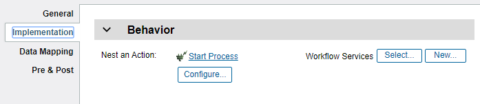
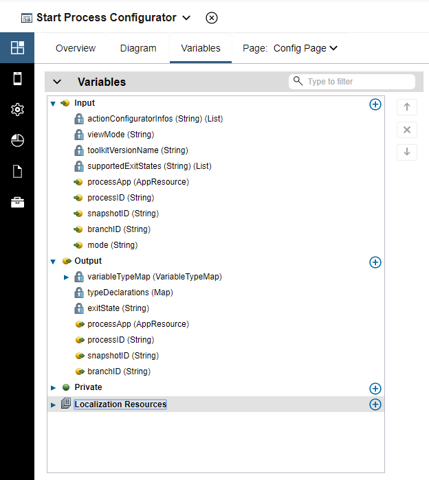
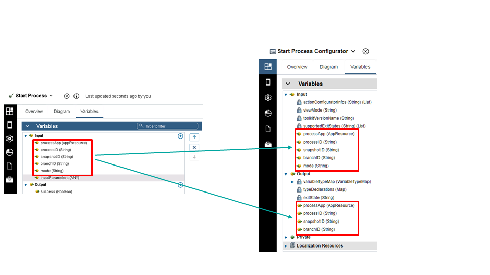
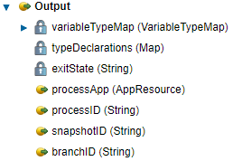
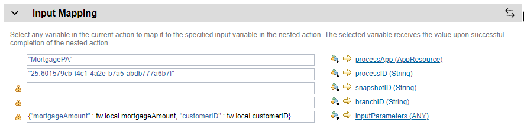
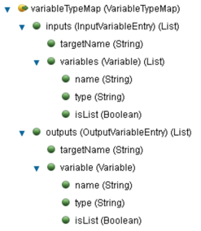
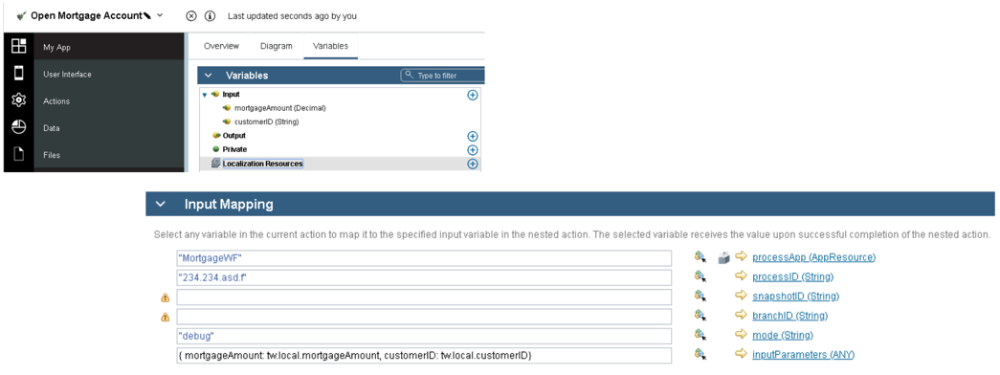

# Action Configurator Authoring Extension
An action configurator allows the user to easily configure your action when being called from a nested action activity inside the action editor.  As an example, a user might be trying to author an Open Mortgage Account action and needs to start a process in BAW.  When an action configurator is discovered for an action, a Configure... button will appear in the properties:  
  
This authoring extension allows the following to be automatically setup for the user using a custom user interface:  
1. Static values for input data map parameters
2. Variables to be created in the calling Action
3. Variables to be mapped to input and from output parameters in the data mapping
4. App Resource references to be created in the settings, with the name used in the data map

# Building an Action Configurator
Start building your action configurator by creating an App.  Add a dependency to your toolkit containing the target action for this configurator.  In the overview, set the app to be used as an action configurator.  As an example, we'll use the Start Process action in this document.

For the **Target action**, click the **Select** button, and pick your target action, for example **Start Process**.  The target action determines when the Configure... button is seen, in the properties of the nested action activity of the action editor.  When the user presses the button, the action configurator is launched to setup the call to the action.

**Notes for the Start Process Sample**:
- The app needs to prompt the user to select a Process App, Process, and maybe optional information.
- The Start Process action is calling a REST service from Business Automation Workflow.
- Such calls have parts that need to be captured by the picker:

`https://localhost:9443/rest/bpm/wle/v1/process?action=start&bpdId=12345&branchId=abcd
-Message body 
-Response body`
                       
|https://localhost:9443/rest/bpm/wle/|v1/process?action=start|&bpdId=12345&branchId=abcd|
|-----------------------------------|-----------------------|--------------------------|
| Endpoint | Rsrc path & start argmnts | Parameters |

**Endpoint**:  This is determined by the AppResource.  
**Resource path & static arguments**: Fixed segments that are specific to the action, but do not appear in the picker.  
**Parameters**: These are statically configured for each instance of a call to the abstract Action, such as Process ID, Snapshot, etc.  
**Message body**:  This data is specific to the Process selected and the structure is governed by the Process input data declared in BAW.  
**Response body**: This is a fixed structure for all calls to the Start Process API because it is an async call that only starts the Process.  Outputs from the Process are not returned.  

When an App is marked as an Action Contributor, and an action is selected, Inputs and Outputs are added to the variables page.  

  

The variables are a mix of locked-in and action-specific.  The locked-in variables apply to all action configurators.  The other variables are automatically added as a result of choosing a target action, but are editable by the configurator developer.  These extra variables may be added and removed as necessary.  The action-specific variables MUST be a subset of input variables from the action that you are configuring.  When values are returned for these output variables from the configurator, the values are used as the input data mapping values.  
  

For the action configurator extension, the fixed inputs/outputs are:  
- Inputs: `actionConfiguratorInfo[], viewMode`
- Outputs: `variableTypeMap(optional), typeDeclarations(optional)`
These variables will be explained below.

When dealing with abstract actions, the ANY type is used to capture data structures that are unknown until the action is being configured. The `variableTypeMap` allows the extension to define concrete types for variables typed as ANY. The types are typically determined by the selected pillar artifact (assuming an artifact is being chosen). The `variableTypeMap` also allows the output to be defined.  The `typeDeclarations` works with the variableTypeMap, allowing required complex types to be created as Business Objects.

**Notes**:
- Only primitives and `AppResources` are permitted for assigning values to static input data map parameters
- Complex type variables should be included in the `variableTypeMap` and `typeDeclarations`
- Variables such as `processID` are specified as both inputs and outputs if the configurator needs to show the previously selected state.
- Not all outputs have to be specified as inputs.

### Configurator lifecycle
In the properties of a Nested Action activity, a base action is selected as a context.  The authoring environment looks for a configurator that is associated with that Action.  If one is found, the authoring environment places a Configure... button in the properties. If the user chooses to configure, the authoring environment launches the configurator as an App.

For the Start Process action configurator, when the actionConfiguratorInfos are passed in for the picker, Process Apps (App Resources) and other pillar assets are retrieved from the server endpoints passed in.

If the configurator returns a "CANCEL" exit state, then no model changes are applied and the dialog is destroyed.  When the app completes with an exit state of "FINISH", the outputs are returned to the authoring environment.

In our example:  

In the referencing Action, the app studio does the following for each output variable:

- If the variable is an AppResource, it creates an AppResource in the project settings (if an identical one doesn’t already exist) and sets the app resource name in the data map. What happens if the category and key are the same, but other properties are different? A new app resource entry with a unique name will be generated. 

- Else, finds a name/type match within the input variables of the target action. The value should be a primitive, so it sets the literal value in the input data map.

**Note**: Static values for complex types are NOT supported at this time. 

  

The variable type map, which is also an output of the app, is used to handle ANY inputs, outputs, or other simple-typed variables that should be mapped to a variable. The following illustrates the type of data that an action configurator must return:

This data structure lists the variables to be created and the target input/output data mapping parameters to which the variables should be mapped:
- `targetName` is the variable name from the Action being configured  (e.g. `inputParameters`).  This determines what the variable will be mapped to in the data mapping of the nested action activity.
- `name`: the name of the variable to create
- `isList`: set to true of the variable is a list
- `type` is the UUID of a business object, a primitive name, or the name of a type definition  
  - Possible primitive names: "String", "Boolean", "Integer", "Decimal", "Date", "ANY"  
  - Example Business Object UUIDs:
    - String : "12.db884a3c-c533-44b7-bb2d-47bec8ad4022"
    - Boolean : "12.83ff975e-8dbc-42e5-b738-fa8bc08274a2"
    - Integer : "12.3fa0d7a0-828a-4d60-99cc-db5ed143fc2d"
    - Decimal : "12.536b2aa5-a30f-4eca-87fa-3a28066753ee"
    - Data : "12.68474ab0-d56f-47ee-b7e9-510b45a2a8be"
    - Any type : "12.c09c9b6e-aabd-4897-bef2-ed61db106297"
    - Map : "12.90c5b1d3-3fa1-4b3b-ab27-220b0652dc55"

For our Start Process example, it would return a `variableTypeMap` that looks like:

<pre>
{  
  inputs:[
    {
      "targetName" : "inputParameters",
      "variables" : [
	{"name" : "mortgageAmount", "type" : "Decimal"},
        {"name" : "customerID", "type" : "String"}
      ]
    }
  ],
  outputs:[
    {
      "targetName": "success",
      "variable": {"name":"success", "type":"Boolean"}
    }
  ]
}
</pre>

As a result of the returned map, the studio creates variables in the Action, then maps them to the corresponding variables in the data map.

The same logic is used to create variables for output and map those variables to the Action being called.

For outputs, only one Property (instead of a list, like inputs) is supported. The reason is that the runtime cannot extract multiple values out of the result and assign them to variables without an additional map.

When the picker is launched again, the inputs for the action configurator are analyzed:
– The primitive static values are passed in using existing values in the data map (inputs)
– Any AppResource parameter types are serialized and passed in.
These values allow the picker to show an appropriate state for the currently set data.

## Complex Types
The action configurator can tell the authoring environment to generate Business Objects needed by the configured Action.  The JSON schema portion of Swagger/OpenAPI is used for this purpose.  For example, code such as the below would cause the "Response" Business Object to be created.  If the "Response" Business Object already exists, then "Response_1" would be created instead.  The name "Response" can be used as the type ID in the variableTypeMap the reference the type.  The authoring enviornment will set the type of the variable to the Business Object created.
<pre>
tw.local.typeDeclarations["Response"] = {
      "type" : "object",
      "properties" : {
        "approved" : {
          "type" : "boolean",
          "default" : false
        },
        "base_price" : {
          "type" : "number",
          "format" : "double"
        },
        "dis_price" : {
          "type" : "number",
          "format" : "double"
        },
        "messages" : {
          "type" : "array",
          "items" : {
            "type" : "string"
          }
        }
      }
    };
</pre>

Not all JSON schema is supported, as there are some limitations.  The int64 format for Integers is not supported.
<pre>
"gainMinuteCount" : {
	"type" : "integer",
	"format" : "int64"
}
</pre>
Likewise, undefined structures (which you might consider to be an Any type) are not supported.
<pre>
"extElements" : {}
</pre>

### Examples
There is a rich set of examples showing various capabilities of action configurators [here](./Examples).

### Delivering your authoring extension
See the topic [Integrating Contributions With Designer](../../../Integrating%20Contributions%20With%20Designer)

