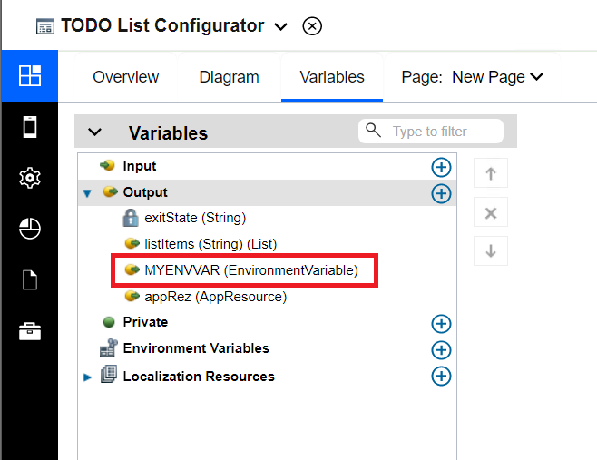

# Application template configurator extension
An app template configurator allows you to inject a user interface into the app creation wizard. If an extension is found for the selected template, a Next button will appear in the app creation wizard:  

  

When the user clicks the Next button, the custom user interface is shown, allowing easy customization of the app:  

  

This authoring extension allows the following to be automatically set up for the user while creating an app based on your template:  
1. Default values for variables of the app
4. App resource references to be created or updated in the settings
5. Environment Variables to be created or updated in the settings

# Building an app template configurator
Start building your app template configurator by creating an app or using the [App Configurator Template](../Templates/App%20Configurator%20Template).  Specify the target app template in the Overview tab of the editor.  As an example, we'll use a TODO list sample in this document.  


### Configurator lifecycle
In the app creation wizard, a template may be specified as the starting point for an app.  If the selected template has a configurator associated with it, a Next button will appear.  When the user presses Next, the app configurator is launched as part of the user task flow.  The supported exit states are "CANCEL" and "FINISH" with obvious results.  If FINISH is returned from the configurator, the app will be created and the values filled in according to the following sections.

Note that at the time of writing, it is not possible to relaunch the app configurator.  It is only used when creating an app.

## Variable default values  
Your application template, and thus resulting application, may have variables defined.  The default values for these variables may be populated via the configurator.  In our TODO list example, the application has a variable called listItems (String) (List).  If the configurator has an output variable of the same name, type, and cardinality then the value will be used as the default value in the new application.  The configurator would define the output variable as:  

  

When creating an application, if the user filled out the configurator as seen here:  

  

Then the application would have this set in the application:  


## Environment variables  
Your application template may require the use of environment variables.  In your configurator, you may create an output variable of type EnvironmentVariable.  Upon creation of the application, an environment variable will be created (or updated) with the value provided.  The configurator would define the output variable like:  

  

With the configurator filled in as previously shown, the resulting application would have the following environment variable:  

 

## App resources  
Your application template may require the use of app resources for endpoint resolution.  In your configurator, you may create an output variable of type AppResource.  Upon creation of the application, an app resource will be created (or updated) with the value provided.  The configurator would define the output variable like:  

  

The configurator might set this output variable like:  
```javascript
var appRezObject = {};
appRezObject.name="TestAppRez";
appRezObject.type= "DEFINED_ENDPOINT";
appRezObject.authType = "BASIC";
appRezObject.username = "someuser";
appRezObject.password = "thepassword";
appRezObject.host = "my.company.com";
appRezObject.port = "9443";
appRezObject.scheme= "http";
tw.local.appRez = JSON.stringify(appRezObject);
```
The resultant application would have an app resource such as:  

  

### Delivering your authoring extension
See the topic [Integrating Contributions With Designer](../../../Integrating%20Contributions%20With%20Designer)
