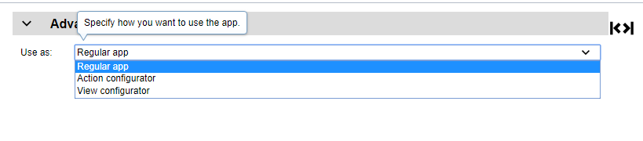
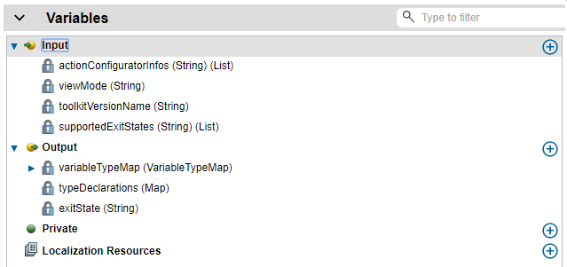
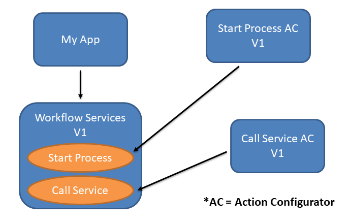
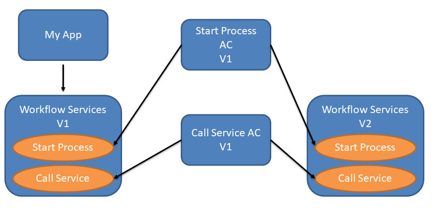
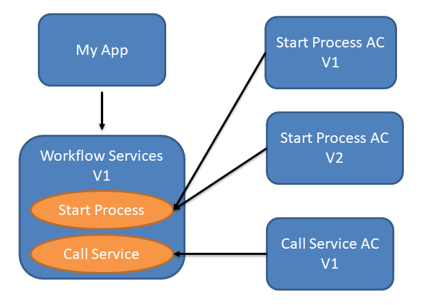
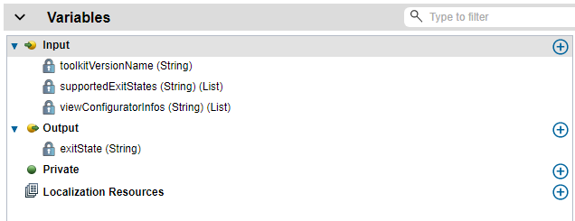

# Authoring Extensions
The App Designer provides the opportunity to extend the authoring experience with user interfaces that make it easy for users to consume your contributions.  There currently exists three authoring extensions:  
1. [Action Configurators](./Action%20Configurators)
2. [View Configurators](./View%20Configurators)  
3. [App Template Configurators](./App%20Template%20Configurators)  

The effects on the modeled artifacts are different for each case.  All authoring extensions share some common behaviour, however.  This topic will cover the commonalities, and sub topics will cover the specifics of each type of extension.

## When to Create an Authoring Extension?
Let's take the Workflow pillar as an example. It has contributed an action, Start Process, that enables starting Workflow processes. Here are some reasons why an action configurator would be useful in this case:  
1. The action is using App Resources to dynamically resolve Process Apps.  The creation of the App Resource reference and the corresponding key are neither simple nor intuitive for the user to determine.  It would be much simpler if the user could choose from automatically discovered Process Apps from a dropdown.
2. One of the parameters is the process ID.  This value is difficult to find in Workflow, and would require the user to go into that pillar in order to find the ID.  It would be a much better user experience to list the processes by name inside of a selected Process App.
3. The input parameters of the process need to be determined and populated based on the selected process.  A custom UI could discover the interfaces, create the appropriate variables and data types, and map the variables to the generic inputParameters of the Start Process action.  
	
The same reasoning can be used with Views.  Your view might need to be configured with an App Resource or might require complicated IDs to be entered for its configuration.  

If you have created an App Template, you can create a configurator that is integrated with the App creation wizard when a user chooses your template. This allows your template consumer to enter some configuration upfront, without having to search in App Designer to find the pieces of information that need to be customized.

## Building an Authoring Extension
You build your authoring extension in App Designer as an App.  To get started, you may launch BA Studio and create an App.  On the overview tab of your App, use the Advanced section to change the intended usage of the App.  Ensure you are in advanced mode if you don't see the overview tab or the Advanced section.  An even better way to get started is to use the extension templates in the folder [Templates](./Templates).  Download the template corresponding to the extension type and create an App based on that template.
  
The drop down allows you to select from the available authoring extensions.  Selecting one of the options will reveal other required settings, such as the target Action or View for this authoring extension.  Once an App is marked as an authoring extension, the variables for the App change.  An App normally just has variables declared as "Data" because an App doesn't have any inputs or outputs.  However, when an App is being used as a UI extension, the types of variables are extended to include inputs, outputs, and private variables.  The inputs and outputs represent the contract between the authoring environment and the extension.  For example, an Action Configurator will have these locked-in variables:  
  
The details for these variables is covered in the sub topics.

After setting your App to be an extension and pointing to your target artifact, or using one of the templates, develop the user interface as you would any other App.  When the flow of your App reaches an End node, the output variables will be sent back to the authoring environment to be processed accordingly.  The templates set up many of the return codes for you and include buttons and layouts that integrate well with the authoring environment.

## Exit State
Each authoring extension has a locked-in output variable called exitState.  This output variable allows the extension to tell the authoring environment how the user wishes to proceed.  For example, when a view configurator is running, the UI should provide Cancel and Finish buttons.  It should also have a button to switch the properties view to the default/advanced rendering.  Constants like "CANCEL", "FINISH", and "ADVANCED_PREVIEW" are used to communicate the user intent.  When the configurator is launched, the supported exit states are passed in via the supportedExitStates input variable.  For example, a view configurator may be launched in a "properties" setting today.  We may launch these configurators in the future in a different context, such as a higher level asset discovery mechanism and the "ADVANCED_PREVIEW" exit state may not be supported.  The UI of the configurator should adapt to show only the controls that support the set of supported exit states.  See [Templates](./Templates) for more information.

### The App Resource Type
Your contributions may wish to make use of App Resources.  If so, then your designer extension may want to allow the user to easily select a resource.  Your contribution may have the App Resource reference created for you.  Your extension should use the special "AppResource" type as an input/output parameter.  This business object is an extension of String.  From your extension, a stringified JSON structure should be returned as output and expected as input.  The data structure is as follows:
- name: The base name to use for the App Resource reference.  This will be used as a base to create a unique name within the scope of the project.
- type: "REGISTRY_LOOKUP" | "DEFINED_ENDPOINT“
- authType: "BASIC" | "OIDC“
- if authType is BASIC:
  - username
  - password
- if type is REGISTRY_LOOKUP:
  - key: eg process app ID
  - domainSegment: eg “IBM_WORKFLOW”
- if type is DEFINED_ENDPOINT:
  - host
  - port
  - scheme: "http" | "https"

The above data is used to create the App Resource in the project settings, with the name or alias being set in the model of the calling artifact.  When your configurator is relaunched, the authoring environment will look up the App Resource and serialize the information as a JSON string to pass back to the configurator.

### The Environment Variable Type
Your contributions may wish to make use of Environment Variables.  If so, then your designer extension may want to allow the user to easily create or update the Environment Variables.  Your contribution may have the Environment Variable reference created for you.  Your extension should use the special "EnvironmentVariable" type as an input/output parameter and environment variable's name as the input/output name.  This business object is an extension of String.

With the input/output variable name being set in the model of the calling artifact.  When your configurator is relaunched, the authoring environment will look up the Environment Variable will pass back to the configurator.

## User Interface Consistency
When developing the user interface, try to adhere to patterns seen in the rest of the authoring environment and other extensions.  This will ensure a smooth, consistent user experience.  For example, using a [Carbon look and feel](https://www.carbondesignsystem.com) is very important.  By leveraging the controls in the UI Toolkit with the Carbon theme, your UI should have some of the basics in place. To help you get started and ensure you have a UI consistent with other contributions, use the templates from the topic [Templates](./Templates).

## Authoring Extensions and Releases
When the authoring environment attempts to find an authoring extension, it does so by ignoring the version of the toolkit in which the target action/view resides.

Let’s use the Workflow contributions as an example to illustrate how this system works.  Workflow contributes the Start Process action and configurator.  It also contributes a Call Service action and configurator.  The configurators point to the artifacts, which are shipped inside the Workflow Services toolkit.  Everything starts at version V1.  
  

When the user selects Start Process as the nested action implementation, the authoring environment tries to find an Action Configurator whose target action is Start Process.  It finds the Start Process AC and shows that designer extension.  The toolkit version in which the action resides does not matter.  

**Scenario: Updating Action/View Toolkit**
Now let’s say the Workflow Services TK is updated with a new version, V2.  How does this work?  The Start Process action configurator does not need to change because the configurator is valid for all versions of the Action.  In reality, the Start Process AC project depends on a **specific** version of the Workflow Services toolkit.  But in the extension discovery logic, it finds both versions as matches because the toolkit version is ignored.
  
If the user updates the toolkit dependency to Workflow Services V2, the same configurator will be used.

**Scenario: Pillar Updates Configurator**
An App is using version V1 of Workflow Services TK.  The Start Process action configurator V1 exists and depends on Workflow Services V1.  BAW is updated with a new action configurator for Start Process AC (V2).  Start Process configurator V2 points to existing Workflow Services toolkit V1.  
  

In this scenario, both Action Configurators will be found, however the authoring environment will ensure that the latest version is used.  Project snapshots have a timestamp associated with them, and this timestamp is used to determine the latest version.  Start Process AC V1 becomes dormant and isn’t used in the environment.  

**Important considerations with this mechanism**  
The authoring environment always assumes compatibility between the target asset and the configurator.
Many scenarios fall out of this:  
1. Releasing a new configurator => Must be compatible with all previous versions of the target asset. For example, if an Action has been around for many releases without a configurator, and the upcoming release is going to have a configurator for it, the configurator must work with all back levels.  
2. Releasing a new toolkit => Assets with configurators must be compatible with all versions of configurators for the assets.
App Designer always uses the latest version of the configurator. If there is a breaking change in a target Action or View with respect to its authoring extension, then an entirely new Action/View needs to be created, along with a new Action or View Configurator.  

The version info of the toolkit that contains the target asset is passed into the configurator so it can behave appropriately for various versions.  This allows for more backwards compatibility, and reduces the need to create new Actions.  

## Passing Contextual Properties from Contributing Server
With both action and view configurators, there is the ability to have custom properties passed to your configurator from the pillar/server making the contribution.  Take BAW contributions for an example.  With the Start Process action, the contributor needs to present known Process Apps to the user.  The process apps are discovered by making an API call to a workflow server.  How does the configurator know the server(s) to call to make the discovery REST call?  One solution is to have the use enter the server information in the configurator.  This is not ideal.  Every single App author would need to know the server addresses, which would be cumbersome.  Instead, the server may integrate more closely with App Designer and have these endpoints automatically known and passed to the configurator.

The resource registry is used to pass in this extra info.  Here is an example of an action configurator being registered with an additional sibling property called actionConfiguratorInfo:  
```javascript
"key": "/dba/appstudio/contributors/IBM_WORKFLOW/creditWF",
"value": {
	"actionConfiguratorInfo": {
		"protocol": "https",
		"hostname": "creditWF.fyre.ibm.com",
		"port": 9443
	},
	"contributionInfos": [
		{
			"name": "Start Process Configurator",
			"id": "2066.1ddaefd6-6d52-48e8-adb7-57f5b4d6c705",
			"type": "TWX",
			"version": "2064.47bca226-ad7b-4d4f-8a08-355150f5c788"
		}
	]
}
```

The value for the actionConfiguratorInfo is completely up to the pillar and configurator.  In general, it will be a stringified JSON object.  In the case of BAW above, the server information is included.  This information will get passed into the configurator whenever it is launched.  The information will get passed in for all contributors in the contributionInfos properties.  The configurator info will get passed in for all versions of the contributor as well.  Only the id is used to determine if the info should be passed in.  This is another consideration for forwards/backwards compatibility when authoring your contributor.  For view configurators, the viewConfiguratorInfo property may be added to perform a similar ability.

The actionConfiguratorInfo and viewConfiguratorInfo data is passed to the configurator via the interface of that authoring extension.  When creating an action configurator, you can see this locked input variable created automatically for you:  
  
Likewise, if you create a view configurator:  
  

Note that in both cases the variable is a list.  This is because **all** matching actionConfiguratorInfos/viewConfiguratorInfos will be passed into the configurator.  This is useful in case, for example, there are many BAW servers running in the system.  The user selecting the Process App in the configurator should see a union of all Process Apps across all servers.  

## Delivering your authoring extension
Authoring extensions should be delivered to your users alongside the artifacts that they are configuring.  The target Actions and Views will be in toolkits, but each authoring extension is a separate, independent App.  You need to export your App as a twx file and deliver it to consumers as per the topic [Integrating Contributions With Designer](../../Integrating%20Contributions%20With%20Designer).
