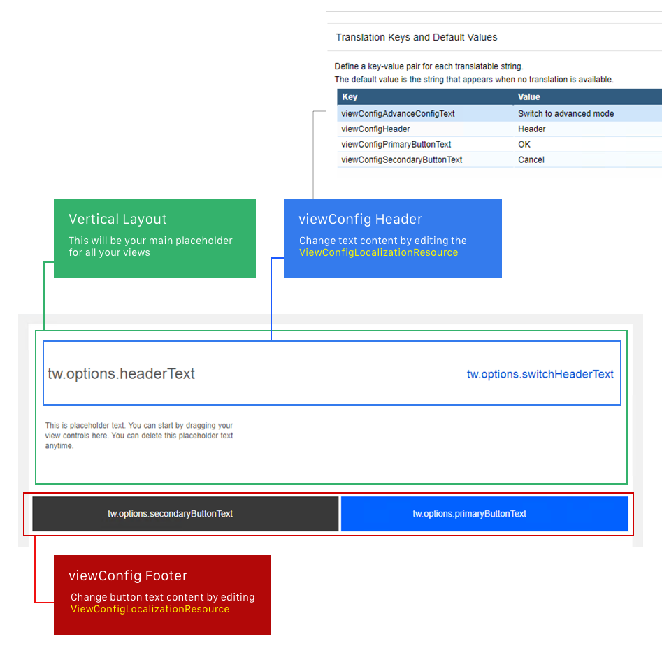
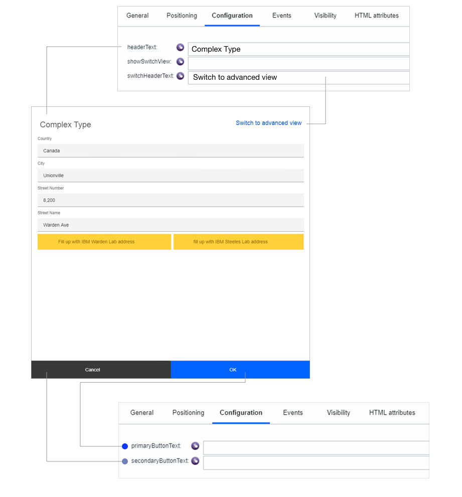
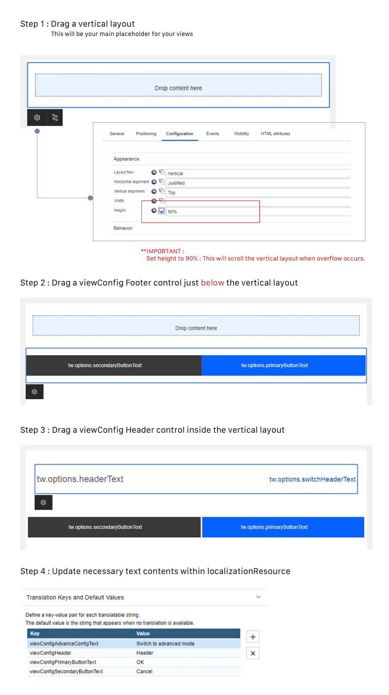
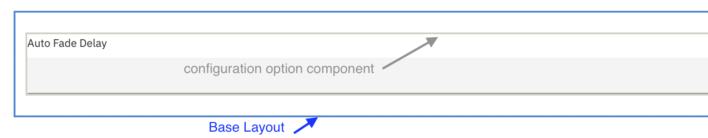
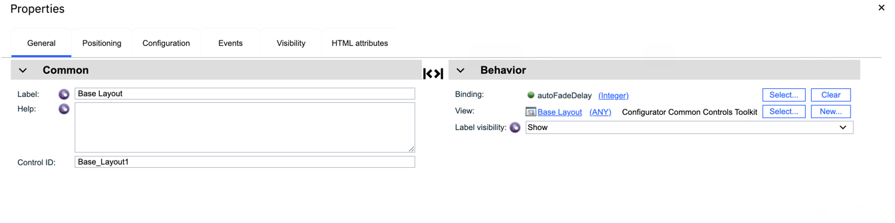
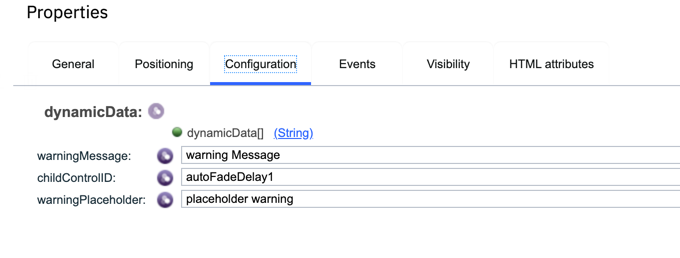
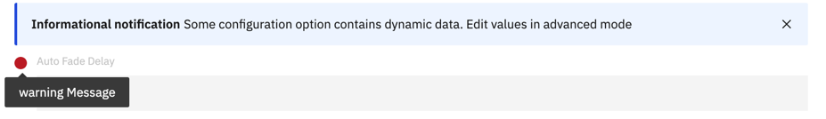
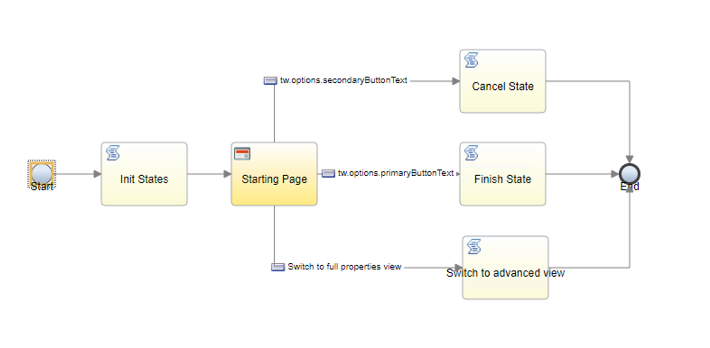
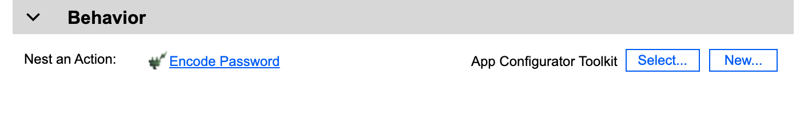

# Configurator Templates
Configurator templates is designed to help configurator authors create their UI design that can easily resemble to the current BA Studio's properties slide-out panel. There currently exists two configurator templates:

1. [Action Configurator Template](./Action%20Configurator%20Template)
2. [View Configurator Template](./View%20Configurator%20Template) 
3. [App Configurator Template](./App%20Configurator%20Template) 

## Anatomy of configurator template

1. **Header View** (ViewConfig Header / ActionConfig Header)
- Contains a header text and a link button that has the ability to switch between advanced properties and basic view configurator mode. 
- Link button is customizable. User has the option to show or hide this button to the user.

2. **Footer View** (ViewConfig Footer / ActionConfig Footer / AppConfig Footer)
- Contains primary and secondary buttons
- Each button can be customized depending on the needs of the view configurator.
- By default, primary button is wired to FINISH exit state, while secondary button is wired to CANCEL(BACK in App configurator) exit state. 

### Configurator during design time

  

### Configurator during runtime

 

### Consuming template views
The following instructions will show you how create your configurator from scratch by using the views provided within the template.

  

#### **NOTE** : It is important to set the vertical layout height to 90%. 90% is the suggested height. This will fix the overflow within your configurator itself.

## About Dynamic data

By design, user can only bind dynamic variables to configuration options in advanced mode, and if the option is bind to a dynamic data, then we will disable the option in view configurator.
The following instructions will show you how to dealing with some configuration options contains dynamic data.

1. Add Base Layout (from Configurator Common Controls Toolkit) to the configuration option component
   
2. Config Base Layout, in the general tab, binding the option variable
   
3. In the configuration tab, set up the options 
   1. **dynamicData** - binding to tw.local.dynamicData
   2. **warningMessage** - ***optional*** the warning message when the option is dynamic data
   3. **childControlID** - the Base Layout's child which is the configuration option component's Control ID
   4. **warningPlaceholder** - ***optional*** the placeholder text for the configuration option component
      
      
      
## About exitState
By default, when setting the "use as" property to configurator, locked variables are initially created. One of the most important part when using this template is the exitState.

exitState is where you set the exit codes needed to communicate between the configurator and BAS authoring environment. This will trigger specific behaviours within the authoring environment itself.

1. **CANCEL** - Force cancel and undo all changes. This will force the properties slide-out window to close. All information will not be saved when choosing this state.
2. **FINISH** - Save all changes and force properties slide-out panel to close.
3. **ADVANCED_VIEW** - Trigger to call to toggle properties to advanced mode.
4. **BACK** - Trigger to go back to name the new App page.

By default, the template already wired the basic settings in creating your configurator. This gives a basic overview on how your configurator will work and interact with BA Studio authoring environment.

  

## About encode password
####Only required in App Configurator
Before transfer the password inside AppResource, we need to encode it inside the configurator, we have provided an action "Encode Password" to encode the password.
