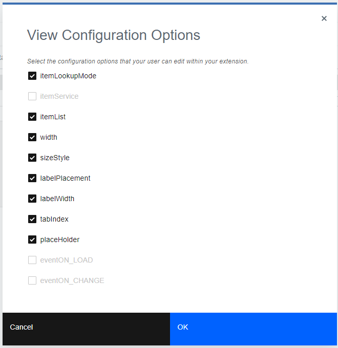
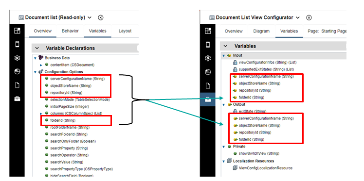

# View Configurator Authoring Extension
A view configurator allows the user to easily configure an instance of your view when used in the layout of an App Page or a reusable View.  As an example, your view might need some server information set or an ID that is difficult for the user to determine.
 
This authoring extension allows the configuration data of a view instance to be set via a custom user interface.  The configuration data for a view instance is directly related to the configuration options declared on the View.  The extension will be rendered as the properties of the view, and the user will have the option to view the full properties as well.

# Building a View Configurator
Start building your view configurator by creating an App.  Add a dependency to your toolkit containing the target View for this configurator.  In the overview, set the app to be used as a view configurator.  As an example, we'll use the Document List view.

For the **Target view**, click the **Select** button, and pick your target view.  The target view determines when the configurator will be used as the properties for a view instance.

**Notes for the Document List Sample**:
- The view needs to interact with an Content object store
- The view needs to be configured with a search or folder
- The columns to show and action enablement as configurable by the consumer

When an App is marked as a View Contributor, and a View is selected, you are prompted to add configuration options as inputs/outputs of your configurator.  Only object-typed config options are enabled for selection.

  

The variables of your App are a mix of locked-in and view-specific.  The locked-in variables apply to all view configurators.  The other variables are chosen after selecting a target view, but are editable by the configurator developer.  These extra variables may be added and removed as necessary.  The view-specific variables MUST be a subset of configuration options from the View that you are configuring.  When values are returned for these output variables from the configurator, the values are used as the static configuration values.  
  

For the view configurator extension, there are two fixed input variables: 
- Input: `viewConfiguratorInfo[]` The viewConfiguratorInfo allows contextual information to be passed in from the contributing server, as described in the parent topic.
- Input: `supportedExitStates[]` The list of permitted exit states, as described in the parent topic.

**Notes**:
- Only static values are supported for config data
- AppResources are also allowed and are handled according to the parent topic (a JSON string is passed back and forth, with the App Resource reference name being set as the config data value)
- EnvironmentVariables are also allowed and are handled according to the parent topic.
- Not all outputs have to be specified as inputs.

### Configurator lifecycle
1. When a view instance is selected and the properties are requested, the authoring environment looks for a configurator associated with that View.
2. If one is found, the authoring environment launches the App in a pane in the editor.  
3. Any viewConfiguratorInfos from the registry (see parent topic for details) are discovered and passed into the App.
4. When the app completes (the user presses finish/done/ok button in the app and an end node is reached in the flow), the outputs are returned to the authoring environment.
5. In the View/Page being authored, the app designer does the following for each output variable if "ADVANCED_PREVIEW" or "FINISH" is the exit state:
    - If the variable is an AppResource, creates an AppResource in the project settings (if one doesn’t exist for the id/key) and sets the app resource name as the value for the config data.  What happens if the key is the same, but other properties are different => new App Resource entry with unique name will be generated.
    - If the variable is an EnvironmentVariable, it creates or updates an EnvironmentVariable in the project settings.  
    - For all other types, the value is saved as the config data with the specified config option name.
6. In addition to the above: "FINISH" will cause the dialog to disappear.  If "ADVANCED_PREVIEW" is returned as the exit state, then the properties view will switch to the default/advanced mode AFTER all the model updates are completed.
7. If "CANCEL" is the exit state returned, then the model is not updated and the dialog disappears.
8. When the view configurator is launched again, the inputs for the App are analyzed. The values in the model are passed in to matching config option names. Any AppResource parameter types are serialized and passed in. These values allow the extension to show an appropriate state for the currently set data.

Because the config data is being changed for the view, it is possible to switch to the default/advanced properties page and see the values that have been set by the view configurator.

### Responsive
If your configuration option is responsive, then the framework will pass you the value for the current device size.  When you return a value, it will be set as the value for the current device size.  Pay special attention to the differences between unset and set values.  For example, a String setting with "" as the value is set.  That is, at runtime the "" value will be passed in as the value.  In the setting is null or undefined, then the runtime value may be that of the inherited device size.  For responsive options, the values are inherited from the next set value, going larger in device size.  Medium inherits from large.  Small will inherit from medium, if set, or from large.

### Built-in Configuration Options
The built-in configuration options may also be managed by your view configurator. These configuration options are named like: `@label`, `@width`, `@padding`, etc. However, you cannot create input and output variables with `@` in the name. To specify these configuration options, replace `@` with `__AT__`.  Note there are two prefix and two postfix underscores. For example, if you want to allow the user to set the label from your configurator you would specify `__AT__label` as both an input and output variable of your configurator.

### Limitations
A configuration option may be declared as an Object, Service, or Event.  The Service and Event types of configuration options are not supported by view configurators.

The default properties pane allows the user to bind a configuration to a variable.  This is not support by view configurators.  Only static values may be set by a view configurator.

If a user wants to set Services, Events, or use variables, they can choose to see the default properties view in the editor.

### Examples
There is a rich set of examples showing various capabilities of action configurators [here](./Examples).

### Delivering your authoring extension
See the topic [Integrating Contributions With Designer](../../../Integrating%20Contributions%20With%20Designer)

