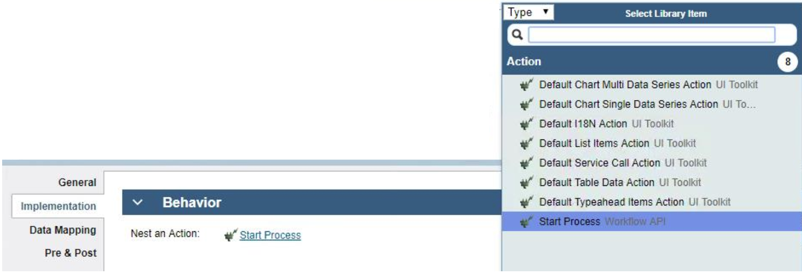
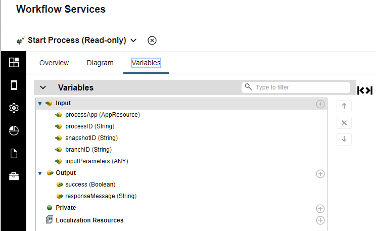
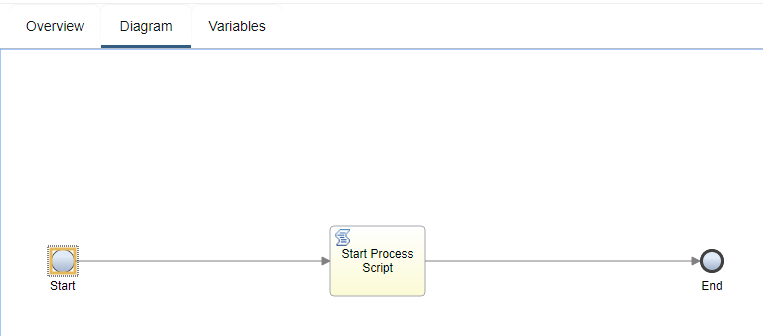
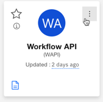
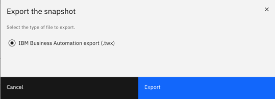

# Building your contributions

To author your contributions, you use the Application Designer within Business Automation Studio. After you've determined what you want to contribute, log in to the studio and start developing.

As mentioned in the introduction, most contributions for supporting applications will be in the form of actions and views. These assets need to be created in a toolkit, which will then be exported and integrated into the users' Application Designer environment. There are many considerations to think about when contributing each of these assets.

### Building an Action

Let's use the Workflow pillar as an example. This pillar contains user-authored processes, and we want to enable a business developer of an application to start a Workflow process. The Start Process action performs this function, and can be considered a low-level or abstract action from a contributing pillar. It is abstract because it doesn't start a particular process, but enables the starting of any process, with the process specified in the parameters of the Start Process action. In another section, we'll see how an action configurator is used to help configure the Start Process action.

In this example, the business developer is creating an action for opening mortgage accounts. Opening a mortgage account is implemented by a Workflow process. This action leverages the Start Process nested action, which relies on a Workflow Services toolkit that wraps a selection of REST APIs.

- The Start Process action is calling a REST service from Business Automation Workflow.
- This REST API has a certain structure to its URL and dicates the message and response bodies:

`https://localhost:9443/rest/bpm/wle/v1/process?action=start&bpdId=12345&processAppId=abcd`

`-Message body`

`-Response body`
                       
|https://localhost:9443/rest/bpm/wle/|v1/process?action=start|&bpdId=12345&processAppId=abcd|
|-----------------------------------|-----------------------|--------------------------|
| Endpoint | Rsrc path & start argmnts | Parameters |

**Endpoint**:  This is the server-specific information on which the Process Application running.

**Resource path & static arguments**: Fixed segments that are specific to the action.

**Parameters**: These are configured for each instance of a call to the abstract Action.  Things like the Process Application ID, process ID, etc., appear here.

**Message body**:  This is specific to the instance of the call to the abstract Action and is governed by the modeled input parameters of the Process in Workflow.

**Response body**: Because Start Process is an asynchronous call, the response body is the same for all callers of this action.

Given the above information about the REST API, an abstract action needs to be created to expose the API into the model and authoring environment of Application Designer. The Workflow pillar developer would open Application Designer, and create a toolkit, which in this case is named Workflow Services. After opening the toolkit with Application Designer, a new action called Start Process is created, and the inputs and outputs are set as:  

We can see that the parameters for various parameter IDs are captured as Strings because these parameters and their types are known ahead of time.  For the message body, the inputParameters input variable is declared of type ANY. This is because the input parameters for a process are governed by the selected process.  Furthermore, the inputs to the process will very likely be dynamic at runtime, where the process ID will always be the same.

The special type used in the parameters is the processApp which is specified as an Application Resource. An Application Resource is a concept that is introduced to enable the dynamic resolution of resources. For more information about this capability, see:  
[Application Resources](./App%20Resources).

The logic of the action is modeled as a flow-based diagram:  

The Start Process action leverages some runtime APIs to accomplish its task. A server-side script activity is used to make the REST call to the BAW server. In doing this, an asynchronous call needs to be made. However, the runtime flow of the diagram needs to be halted and then resumed once the asynchronous call is finished. The `tw.system.waitForContinueFlow()` call is used to halt the flow. If this call is made, the script needs to ensure that `tw.system.continueFlow()` is eventually called. Also, to leverage the Application Resource support, the `tw.system.performRequest(name, options, callback, errorcallback)` API is called. The runtime will take the alias name of the Application Resource reference and dynamically resolve it to an endpoint then make the REST call. For more information on these APIs, see   
[Knowledge Center - JavaScript APIs for actions](https://www.ibm.com/support/knowledgecenter/SSYHZ8_19.0.x/com.ibm.dba.appdesign/topics/ref_appdesign_action_api.html).

With the action contribution finished, the next optional step is to provide a custom user interface to configure it.  See:  
[Authoring Extensions](./Authoring%20Extensions).

### Building a View

Building a view contribution is similar to creating an action. You use Application Designer to create your new view in a toolkit. A view can declare configuration options for customizing each instance of the view. The details for developing views are covered by the Knowledge Center and other resources, such as Redbooks and articles:  
[Knowledge Center](https://www.ibm.com/support/knowledgecenter/SS8JB4/com.ibm.wbpm.wle.editor.doc/topics/cviews.html)  
[Redbook](http://www.redbooks.ibm.com/redbooks/pdfs/sg248355.pdf)  
**Note that the Application UI framework is based on the BPM/BAW Coach framework**

Views may also wish to dynamically resolve resources dynamically, just like actions. For example, a view may be showing the content from a repository. The location of the respository will vary between the development, testing, and production environments. A config option may be declared with the Application Resource type for this purpose. At runtime, the view can pass the alias of the Application Resource to an action running on the server to dynamically resolve the endpoint. For more information about this capability, see  
[Application Resources](./App%20Resources).

When the view contribution is finished, the next optional step is to provide a custom user interface to configure it.  See:  
[Authoring Extensions](./Authoring%20Extensions).

### Debugging During Development ###
You may find it necessary to debug your View or Action while developing your contribution. Debug using the techinques described in the Knowledge Center, which apply to regular Applications as well:

1. To debug Views that you are developing, use "debugger;" statements in your code to programmatically add break points.  You can also use rergular console.log() statements in your JavaScript to print content to the browser console.  Another technique is to have temporary UI content in your view during development.
2. You can add log statements in your Action using the tw.system.log(tw.system.model.name, tw.system.model.step.name, logString) API [as specified here](http://cisdev01w.fr.eurolabs.ibm.com:9190/support/knowledgecenter/SSYHZ8_20.0.x/com.ibm.dba.appdesign/topics/ref_appdesign_action_api.html) or [in the public docs here after Q1 release](https://www.ibm.com/support/knowledgecenter/SSYHZ8_19.0.x/com.ibm.dba.appdesign/topics/ref_appdesign_action_api.html).  By using this API to log your trace, the trace will be sent back to the browser and the user can check the log in the browser console. This is much simpler than trying to find the logs of the server.  The trace will always be sent back to the browser if it is a playback server OR if BROWSER_LOG_LEVEL is set to 3 or higher in a production Application Engine.
4. Set the Application Engine node log level to trace by setting the parameter `appEngine.logLevel.node` to trace. [More info on Application Engine Parameters](https://www.ibm.com/support/knowledgecenter/SSYHZ8_19.0.x/com.ibm.dba.ref/k8s_topics/ref_bas_params.html).

### Exporting your contribution as a .twx file
We now have actions and/or views that are ready to be used by applications. The next step is to export the contributions from the development environment so that they can be imported into a user's environment. You do this by creating a snapshot of your project, going to Studio and exporting the snapshot.

1. From left-navigation menu in the studio, click Toolkits. 
2. Hover over your toolkit, click the menu button in the upper-right corner, then click Export. 

If you have not created a snapshot for this toolkit, you will be prompted to create one. 

3. From the Export a snapshot window, click Export. The toolkit is downloaded to your local downloads directory. 

With the .twx file in hand, you now need to make some decisions about how you will deliver it to your users. This topic is covered by:  
[Integrating Contributions With Designer](../Integrating%20Contributions%20With%20Designer).
