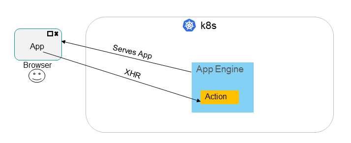
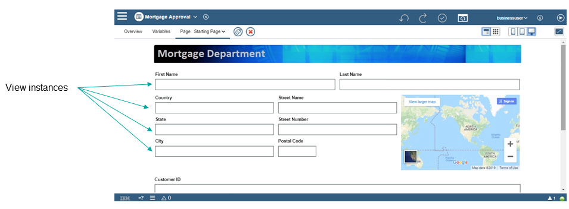
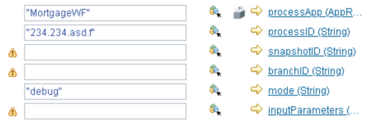
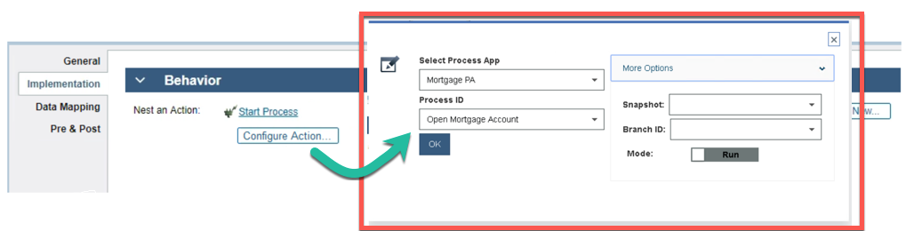

# DBA Application Contributions

### Introduction

The Digital Business Automation (DBA) platform is a robust and renowned suite of business automation capabilities that is comprised of various pillars. Each pillar is carefully designed and developed to meet the dynamic automation needs of businesses worldwide. 

One of the latest additions to the DBA platform is Business Automation Studio: a place where business users of varying skills can build and manage all the aspects of their business automation projects. The designers for the various pillars can be accessed and launched from one central landing page called the Business Automation Studio.

Along with the traditional DBA pillars, such as Content, Workflow, Decisions, etc, a new capability has been added in the form of Business Automation Applications. These applications are UIs that leverage the capabilities from the other pillars in order to achieve some business need. Thanks to the addition of Contributors within Application Designer, it's now easier for you (the technically savvy developer) to contribute to the library of assets, thus improving the application building experience for your business developers. 

This document takes a step-by-step approach to describe how pillar contributions work within the studio, and how your pillar can start contributing your assets to the business application design process. 

### Knowledge primer: What are automation applications?

Simply put, automation applications are the things that you build inside the Application Designer for your business users to use when they develop their interface-driven business applications.  

Applications are composed of user interfaces (UIs), which run on the client, and Actions, which run on the server. Think of applications as front-end UIs driven by back-end business logic. The server on which an application is deployed is called an Application Engine server.

Applications are based on templates that are created by a more technical user. Templates contain starter artifacts that are copied to a new application based on the template.  Template may also reference toolkits, which are libraries of building blocks (or assets) that can be used to create applications. Toolkits are where your contributions come into play. Simply put, toolkits are used by templates, and templates are the basis for applications.

The UI for an application uses a composition model, allowing users to drag and drop widgets, which are called Views, into a canvas to compose each page. Each page of an application represents one complete screen.

**Toolkit**: A container of shared artifacts that are used during development to create applications. These artifacts can be provided by pillar contributions. A toolkit generally contains:

- Actions
- Views
- Business objects

**Template**: A predefined starting point that can be used by a business user to create an application in Business Automation Studio. A template can represent a common use case pattern, such as a document renewal template, workflow dashboard template, and so on.

A basic example of an application would be a mortgage approval application. This application is used to help bank associates determine whether a mortgage request is approved or denied. A business developer creates the application based on a specific template, and that template would leverage various toolkits. These toolkits are where you, the pillar developer, can contribute assets. 

Keeping with the mortgage approval application, a simple example of a pillar contribution can be found in the [mortgage approval sample asset](https://github.com/icp4a/ibm-app-designer-samples/tree/master/MortgageApproval). The Business Automation Workflow Center pillar wanted to give application developers the ability to start processes. The Workflow Services toolkit provides a Start Process action that can be used by an application to easily start an application. This toolkit is an example of a contribution.

The Business Automation Workflow (BAW) pillar also saw an opportunity to improve the action configuration process for their users when calling the Start Process action. Before, when business developers configured the Start Process action, they needed to manually configure a series of data mapping fields with the correct values; otherwise, the action wouldn't work. This step in the action configuration process wast time-consuming and  error-prone. 

In order to make consuming the Start Process action simpler, BAW takes advantage of another feature of Application Designer: authoring extensions. In this case, an action configurator can optionally be contributed which provides the ability to have a custom UI when configuring the action. This action configurator pulls in the relevant data and presents it within drop-down lists that the user can easily sift through. 

### Planning your contribution: What can your pillar offer? ###

It's been said that the true value of the converged platform is realized when business users can easily combine platform capabilities together to seamlessly build their end-to-end business solution. With that in mind, consider what pillar assets you want to expose to a business developer to contribute to the seamless business solution. 
 
 When you create your actions or views, target the Assembler and/or Provider user personas.
 
 - **Assembler** is a business developer, who may or may not have much technical knowledge. A no-code or low-code environment is preferred.  It's possible that an Assembler might not understand or be aware of the different pillars in DBA. "Everything just seems to work!"
 
- **Provider** is a highly technical developer, who understands the DBA platform and its assets. A Provider is comfortable with JavaScript and other web technologies. He creates UI widgets and Actions that are easy for an Assembler to use. The Provider might use an Action or View contributed by a pillar to achieve this goal. 

There are two main types of assets you can develop inside the Studio (Application Designer) that can be used by applications:

- **Views**, which is our name for a visual widget that may interact with assets or server-level information from your pillar. Some examples of views include a document explorer from the Content pillar, or a widget for analyzing a physical document from the Datacap pillar. 

- **Actions**, which is our name for a service that runs on the Application Engine server, as opposed to the browser. Think of actions as the implementation logic for XHR calls from your application. Actions allow interaction with pillar assets or server-level capabilities. Some examples include starting a Business Automation Workflow process, or calling an Operation Decision Manager business rule. 

Whether you create a view or an action, there are two development methodologies you can utilize:

- **Asset-agnostic**, which include generic REST APIs that act on your pillar system, such as getProcesses, startProcess, or executeRule. The REST APIs might require information about an asset, but the REST APIs are generic. Business objects and UI pieces that are generic to the pillar are also considered asset-agnostic.

- **Asset-specific**, which include REST APIs from your pillar that are based on artifacts or assets authored in the system (new swagger/OpenAPI). UIs generated for specific artifacts, and Business Objects supporting authored artifacts are also considered asset-specific.

If you contribute an action or a view, there is the opportunity to extend the default authoring experience to make consumption of your action or view much simpler:

- **View Configurator**, which is an optional custom user interface for setting the configuration options on instances of your view.

- **Action Configurator**, which is an optional customer user interface for configuring a call to your action.  With an action configurator, you can have:
	- data mapping automatically filled in
	- variables created in the calling Action
	- data types created for complex structures

### Creating your contribution and getting it into Application Designer ###
Once you have decided what your pillar can contribute to the Application Designer experience, you need to:
- [Get an Application Designer Environment](./Environment%20Setup)
- [Build your contribution](./Building%20Contributions)
- [Integrate your contribution with Application Designer](./Integrating%20Contributions%20With%20Designer)
