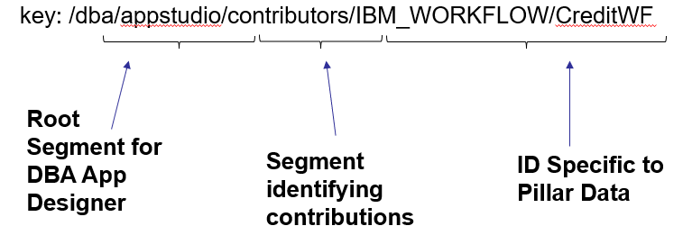

# Resource Registry

### Introduction
With the DBA Resource Registry, we aim to implement a generic, centralized registry for servers running in kubernetes to leverage.  Servers running in k8s will be automatically aware of the registry, whereas servers outside of k8s may require a manual connection by an administrator.  Servers connected to the registry can share information with the DBA Platorm.  Consumers of the registry information will have a high-performance, robust, and consistent way of accessing shared information.  Although the first user of the registry is App Designer, the registry will be generic, allowing for any similar pub/sub relationships.

The Resource Registry is really just an instance of etcd. What is etcd?: 
`“etcd is a distributed  key-value  store designed  to reliably  and quickly preserve  and provide access to critical data”`
Keys and values are strings, with the values often being JSON strings so they can be easily parsed into structured data.  We do not intend on saving binary data in the registry.

[Etcd on github](https://github.com/etcd-io/etcd)

Registry keys are hierarchical in nature, allowing dedicated namespaces for each use case. The main benefits of using carefully constructed key namespaces:
1. Componentize usage of the registry.  The App Designer usage shouldn’t corrupt or contaminate another DBA usage of the registry.
2. It is simple for consumers of the registry to get a range of pairs and to listen for changes in branches.
    - For example, doing a get on “/dba/appresources/” will retrieve all App Resource entries.
	- Likewise, the App Designer can watch “/dba/appresources/” and will get notified when App Resources are added/removed/changed.

How do we ensure that namespaces are unique and that usages of the registry do not interfere?  It is up to developers to ensure that proper namespaces are used and that collisions do not occur.

### Connecting to the Resource Registry
There are two basic configurations when establishing a connecting between the component and the resource registry.
1. Server is inside the K8s cluster
2. Server is outside of the k8s cluster

**Server is inside the K8s cluster**
When a server is running inside the same k8s cluster as the Resource Registry, establishing a connection should be automatic through the deploytment yaml. There are three required values for communicating with the Resource Registry, the endpoint address, a user name and a password. These values can be inserted in your deployment yaml file as environment variables. Your application will be able to make use of the Resource Registry by reading and interpreting these environment values. 
- Your deployment yaml file should define environment variables that your application expectsas these names are completely arbitrary.
For example in the `spec.template.spec.containers` section in a helm chart/jinja2 template, with the correct values for `RSOURCE_REGISTRY_HOSTNAME`, `RRadminSecretName` correctly set:
```yaml
        containers:
        - name: container_name
          image: image_name
          env:
	  - name: RESOURCE_REGISTRY_HOSTNAME
	    value: https://...
          - name: RESOURCE_REGISTRY_AUTH_USERNAME
            valueFrom:
              secretKeyRef:
                name: RRadminSecretName
                key: writeUser
          - name: RESOURCE_REGISTRY_AUTH_PASSWORD
            valueFrom:
              secretKeyRef:
                name: RRadminSecretName
                key: writePassword
```
- In your application, the environment variables are then read and used. For example in Java:
```java
  final String RESOURCE_REGISTRY_HOSTNAME = "RESOURCE_REGISTRY_HOSTNAME";
  final String RESOURCE_REGISTRY_AUTH_USERNAME = "RESOURCE_REGISTRY_AUTH_USERNAME";
  final String RESOURCE_REGISTRY_AUTH_PASSWORD = "RESOURCE_REGISTRY_AUTH_PASSWORD";
  
  String RRurl = System.getenv(RESOURCE_REGISTRY_HOSTNAME);
  String RRuname = System.getenv(RESOURCE_REGISTRY_AUTH_USERNAME);
  String RRpassword = System.getenv(RESOURCE_REGISTRY_AUTH_PASSWORD);
  
  IEtcdLib etcdLib = new EtcdRestLib(RRurl, RRuname, RRpassword);
  String token = etcdLib.authenticate();
  etcdLib.writeKey(token, key, value, null);
```

**Server is outside the k8s cluster**
There will be cases where a server outside of k8s will want to expose its App Resources to be called by apps. In this setup, the external server needs to establish its own mechanism for capturing the connection information for the registry and managing the certificates so that it may make https calls to the registry.
- The certificate of the RR server needs to be imported to the application in classical websphere (https://websphere_hostname:9043/ibm/console), or using `keytool` in websphere liberty. 
```
keytool -importcert  -storetype PKCS12 -storepass <store_password> -keystore <deploy_folder>\wlp\usr\servers\bas\resources\security\ps.p12 -alias resourceRegistry -file rr.cer
```
In NodeJs, the certificate should be added to the certificates trust file manually.
- The endpoint and credential information should be stored in the application. It is still possible to use environment variables or store in a settings file or in a database. The application will be responsible for securing the storage of the credentials via encryption or by protecting access to its database.


### Reading and Writing Entries in the Registry
Etcd has two interfaces. The main interface is gRPC. There is also a REST gateway for clients that are unable to implement the gRPC protocol like clients that use JAVA version < 8. The gRPC protocol is built on top of http version 2 and cannot be downgraded, therefore, clients do not support http 2.0 will also have to resort to using the REST API.
There is also a gRPC client called `etcdctl`. You can download the client suitable for your platform and use it to connect to etcd. etcdctl and etcd do not have to be running on the same platform to establish a connection. For example, you can use a Windows etcdctl to communicate with etcd running on Linux ...etc.
  For Linux-amd64:
```
curl -L https://storage.googleapis.com/etcd/v3.4.3/etcd-v3.4.3-linux-amd64.tar.gz -o etcd343.tar.gz
```
  For MacOS 
```
curl -L https://storage.googleapis.com/etcd/v3.4.3/etcd-v3.4.3-darwin-amd64.zip -o etcd343.tar.gz
```
Then extract the client from the archive.
```
tar zxvf etcd343.tar.gz --strip-components 1 --directory ./ \$(tar tzf etcd343.gz | grep --color=never '\\/etcdctl\$')
```
Refer to etcdctl usage [in etcdctl webpage][5].

For more details, please refer to:

* [The etcd REST API][3]
* [Native client libraries for various programming languages.][4]

To write an entry using `etcdctl txn` (Note how the extra empty lines are used to delineate the check , success operations and fail operations)
```
export ETCDCTL_ENDPOINTS=https://<rr_url>
export KEY="my_key"
export VALUE="my_value"
etcdctl --user=<uname>:<password> txn <<< 'create("'"${KEY}"'") = "0"

put ${KEY} ${VALUE} 


'
```

To write keys using the REST gateway, you need to `base64` encode the keys and the value. Etcd accepts byte sequences for both keys and values. This means that if you want to store a JSON object, you will have to convert it to a UTF-8 string then base64 encode it first.

* First step is to authenticate and obtain a token for subsequent requests, e.g,
```
curl -k https://czardas1.fyre.ibm.com:2379/v3beta/auth/authenticate -d '{ "name": "<uname>", "password": "<password>" }'
```

Make note of the token in the response body because it needs to be used as the value of the "Authorization" HTTP header in subsequent requests to the Resource Registry, e.g. response body
```
{ 
  "header": { 
    "cluster_id": "14841639068965178418", 
    "member_id": "10276657743932975437", 
    "revision": "26", 
    "raft_term": "2" 
  },
  "token": "fxbvyhbFXcJsJRnQ.101"
}
```
The token has a 5 minute expiry, which is the default length used by etcd.  
(If JWT tokens are enabled, the configuration is set for them to expire after 60 minutes)

* Second step is to write a key-value pair:  

Here's an example of the pattern used to add this content e.g.
```
curl -k https://czardas1.fyre.ibm.com:2379/v3beta/kv/put \
-H 'Authorization: fxbvyhbFXcJsJRnQ.101' \
-d '{ \
  "key": "<base64_encoded_see_below_for_more_details>", \
  "value": "<base64_encoded_see_below_for_more_details>" \
}'
```

Here's an example of how to base64 encode the key and value properties using the base64 Unix/Linux utility.

For the "key" Property:
In bash:
```
echo -n "/dba/studio/repositories/IBM_BAW/2066.23d3ecec-6fdb-4033-9c57-e931aa13761f" | base64
```

Output:
```
L2RiYS9zdHVkaW8vcmVwb3NpdG9yaWVzL0lCTV9CQVcvMjA2Ni4yM2QzZWNlYy02ZmRiLTQwMzMtOWM1Ny1lOTMxYWExMzc2MWY=
```
In Java:
Here's a simple 2 line example of how to base64 encode in Java.
```java
String in = "/dba/studio/repositories/IBM_BAW/2066.23d3ecec-6fdb-4033-9c57-e931aa13761f";
String out = org.apache.commons.codec.binary.Base64.encodeBase64(in.getBytes("UTF-8"));
```

[1]: https://etcd.io/  
[2]: https://github.com/etcd-io/etcd  
[3]: https://github.com/etcd-io/etcd/blob/master/Documentation/dev-guide/apispec/swagger/rpc.swagger.json  
[4]: https://github.com/etcd-io/etcd/blob/master/Documentation/integrations.md  
[5]: https://github.com/etcd-io/etcd/tree/master/etcdctl


**Writing entries**
Key structure breakdown:  


For example, we might have something like this for App Designer contributor registrations:
<pre>
key: /dba/appstudio/contributors/IBM_WORKFLOW/CreditWF
Value: {
	contributionInfos: [{
		"filename": "Workflow_Services - v1.0.0.2.twx",
		"name": "Workflow Services",
		"id": "2066.be80b56f-6638-4cb7-aa2d-1252d7148010",
		"type": "TWX",
		"version": "2064.913f2fad-5f86-4b6d-b498-01964bb03f7e“
	}],
}
</pre>


### Leases, Self-healing
Use the “lease” concept in etcd.  When writing entries, you can associate them with a lease, which has an expiration time. If the lease is not renewed by the expiration time, then all the associated entries are removed from the registry.  For BAW: 
- On startup, we write all Process Apps as App Resources with a 1 hour lease.
- We renew the lease using a scheduled task (daemon) or a thread that wakes up every 50 minutes to renew the lease with a connection retry every 5 minutes in case of an intermittent communication failure.  
If the data is erased and the lease is deleted, then the pillar attempts to write all the entries again.  
If BAW goes down, the registry will reflect the proper state in < 1 hour.  
This strong fault tolerance mecahnism is part of the advanced pillar registration design and can be gradually adopted. Refer to the BAW code for a complete reference implementation.

### Keeping registry up to date
Pillar should register proper initial state on startup. 
Pillar should have a listener on its repository in order to keep registry up to date.   
BAW:
- The startup bean also attaches a life cycle event listener to the repository.
- As the result of repository events (create, archive, delete), the resource registry is updated immediately with no delay.


### Transactions
Transactions allow you to create a condition where a set of operation are performed if the check is true, and if the condition is false, a different set of operations is performed. The main advantage of transactions is that they are atomic.  
In a clustered environment, where multiple cluster members will attempt to write the same information using a lease, transactions play an important role.  
The requiremenet is to prevent a race condition between the cluster members when all of them attempt to write the values to the Registry or create a case where last one wins. The transaction operation will not allow a race condition to occur.   
The first cluster member to execute the transaction, will create the lease ID and all the other cluster members will have their transactions simply fail and they will backoff. When the transaction fails for the other cluster members, they will read the value of the lease ID that was created by the first cluster member and use it in the future to modify values or create new ones when required. 
To be able to read the value of the lease ID, the first cluster member to successfully execute the transaction, stores this ID in a special key composed of the cluster ID (logical cluster name). This way all the other cluster members can find it.


- Java code example
```java
public String getClusterID() throws Exception {	
  return CommonServicesDelegateFactory.getInstance().newInstance().getSystemGuid().toString(); 
}

public String getLeaseKey() throws Exception { 
  return REGISTRY_WORKFLOW_KEY + "/" + getClusterID() + "/lease"; 
}
	
public String getLeaseID(String token, IEtcdLib etcdLib) throws Exception {
  String leaseID = null;
  JSONArray lks = etcdLib.readKey(token, getLeaseKey(), false, false);
  if(lks.size() > 0) {
    leaseID = (String) ((JSONObject)(lks.get(0))).get("value");
  }
  return leaseID;
}

public void checkLeaseAndWriteAllTransaction(IEtcdLib etcdLib) throws Exception {
  String token = etcdLib.authenticate();
  
// transaction with a check and operations to perform if check is true (successful)
  JSONObject txnContent = new JSONObject();
  JSONArray compareArr = new JSONArray();
  JSONArray successArr = new JSONArray();
  
// construct the check object. 
  JSONObject compareObj = new JSONObject();
  compareObj.put("result", "EQUAL");
  compareObj.put("key", getBase64EncodedString(getLeaseKey()));
  compareObj.put("createRevision", "0");     
  compareArr.add(compareObj);
  
//the check "success" operations array
// construct 1st operation: store lease key entry for the cluster members
  JSONObject successObj = new JSONObject();
  JSONObject requestObj = new JSONObject();
  requestObj.put("key", getBase64EncodedString(getLeaseKey()));
  String leaseID = etcdLib.createLease(token, leaseTTL);
  requestObj.put("value", getBase64EncodedString(leaseID));
  requestObj.put("lease", leaseID);
  successObj.put("requestPut", requestObj);
  successArr.add(successObj);
  
// construct the desired data operations: store data Key, Value pairs into the Registry
  successObj = new JSONObject();
  requestObj = new JSONObject();
  requestObj.put("key", getBase64EncodedString(REGISTRY_APPRESOURCES_KEY + "/" + ID);
  requestObj.put("value", ObjectValue);
  requestObj.put("lease", leaseID);			
  successObj.put("requestPut", requestObj);
  successArr.add(successObj);
			
// complete transaction body content
  txnContent.put("compare", compareArr);
  txnContent.put("success", successArr);
		
// make transaction call and check if it succeeded. If not, read the existing stored lease
  String txnResult = etcdLib.executeTransaction(token, txnContent);
  JSONObject txnObj = JSONObject.parse(txnResult);
  if (!txnObj.containsKey("succeeded")) {
    leaseID = getLeaseID(token, etcdLib);
    etcdLib.refreshLease(token, leaseID);
  }
```
